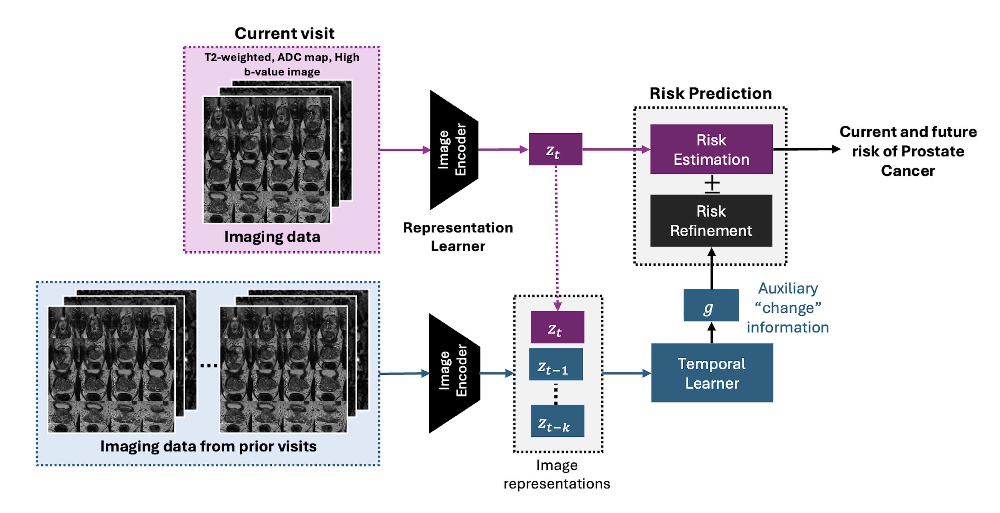

# Context-aware risk steering to reduce false positives in risk assessment

## Overview
This repository provides the definitions for the models used in the 'Imaging Only' risk refinement framework, their training, and evaluation as applied to predicting the risk of prostate cancer.
Context-aware risk assessment framework uses the most recent medical data (in this case most recent prostate MRI) of a patient to assess an initial risk of disease. It then leverages any prior context (prior MRI exams along with the time intervals between current and prior exams) to refine the risk assessment. The use of prior context reduces false positives in risk assessment. The figure below shows an imaging only framework that uses current and prior bi-parametric prostate MRI exams for prostate cancer risk assessment.

This risk refinement framework consists of a) a **representation learner** (RL) model,  b) a **risk estimation/prediction** (RP) model, c) a **temporal learner** (TL) model, and d) **risk refinement** (RR) model.

### Representation Learner
The **RL** transforms clinical data or high-dimensional radiologic imaging data into subject-specific low-dimensional latent representations. It consists of two contrast-specific CNN encoders that, independently, 
transform T2-weighted and diffusion-weighted volumes to a latent representation. A transformer encoder combines the contrast-specific latent representations
into a subject-specific representation.
The **RL** model is trained using PI-RADS guided contrastive learning such that representations from subjects with similar risk assessments i.e., max PI-RADS scores 
are pulled closer to one another while those from different risk assessments are pushed away.

### Risk Prediction
The risk estimation/prediction model predicts risk of clinically significant prostate cancer (PCa) based on the most recent representation. It consists of a series of Dense layer that predict current and future risk of PCa. The baseline layer predicts current estimate of risk. 
Each additional Dense layer (associated with time t after Baseline) predicts the marginal increase in risk at time t compared to the Baseline risk.

### Temporal Learner and Risk Refinement
The **TL** aggregates temporal history (in the form of an arbitrary number of longitudinal representations distilled from previous visits along with corresponding times of those visits with respect to the current visit) into a change signal to steer the initial risk assessment using **RR** model.

## Installation

1. Clone the repository
2. Create a Virtual Environment/Conda environment (python = 3.9.16) 
3. Install the required packages specified in requirements.txt
4. CUDA 11.8, Tensorflow version 2.12.1

